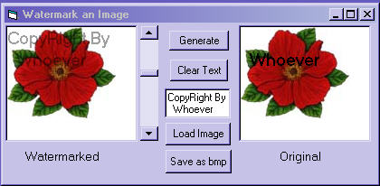



## WaterMark an Image

### Description

Threw this together real quick, hoping it will spark someone with more program knowhow ,to make a first class watermark program with it. The alphablending code is by Aaron DeRenad and the cmndlg mod is by Mr.Bobo.Not looking for votes, just a better working program.
 
### More Info
 

             |
---                |---
**Submitted On**   |2005-01-10 15:44:44
**By**             |[Kenneth Foster](https://github.com/Planet-Source-Code/PSCIndex/blob/master/ByAuthor/kenneth-foster.md)
**Level**          |Intermediate
**User Rating**    |5.0 (25 globes from 5 users)
**Compatibility**  |VB 6\.0
**Category**       |[Graphics](https://github.com/Planet-Source-Code/PSCIndex/blob/master/ByCategory/graphics__1-46.md)
**World**          |[Visual Basic](https://github.com/Planet-Source-Code/PSCIndex/blob/master/ByWorld/visual-basic.md)
**Archive File**   |[WaterMark\_1838871102005\.zip](https://github.com/Planet-Source-Code/kenneth-foster-watermark-an-image__1-58198/archive/master.zip)

